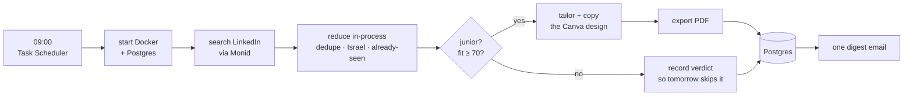

# Job Search Agent

**A daily agent that finds junior software jobs in Israel, judges which ones genuinely fit
*you*, and renders a job-tailored version of your real Canva résumé as a PDF for each strong
match.** One digest email lands every morning at 09:00.

It stops at "here's a tailored CV worth sending." It does **not** apply for you.



The interesting step is the second one. Deduping, the Israel filter and *"have I already
judged this?"* all happen in-process, **before the model sees anything** — so a job you were
shown yesterday costs nothing today, not even tokens. One live run examined 17 jobs for
$3.31; the next run that morning found 15 of its 80 postings already judged, examined zero,
and cost $0.48.

---

## Quickstart

Requires Python 3.11+, Docker Desktop, and a Canva account with your résumé in it.

```bash
python -m venv .venv
.venv/Scripts/pip install -e .
```

Create `.env` at the repo root (git-ignored):

```
ANTHROPIC_API_KEY=sk-ant-...
MONID_API_KEY=monid_live_...
GMAIL_ADDRESS=you@gmail.com
GMAIL_APP_PASSWORD=sixteencharacters
```

The Gmail app password comes from Google Account → Security → App passwords, and needs
2-step verification switched on.

Put your résumé at the repo root as `base_cv.md` (git-ignored). **Canva supplies the layout;
`base_cv.md` supplies the facts.** It is what the agent may reword, and what the truthfulness
guards diff against to catch an invented skill or a fabricated bullet. That check cannot read
from Canva, because Canva is the thing being written to — you cannot validate a write against
its own target.

Then:

```bash
jobs setup
```

Starts Postgres, creates the schema, checks every key, logs into Gmail to prove the app
password works, registers the 09:00 task, and reports whether your power plan will let it
wake the machine. Safe to re-run.

## The three commands

| Command | What it does |
|---|---|
| `jobs setup` | Install everything, once. Idempotent — re-running repairs a partial install. |
| `jobs run` | One day's work. The 09:00 task calls this; run it by hand any time. |
| `jobs pdf <id>` | Write one stored CV to `output/<run date>/` and open it. |

The digest carries **no attachments**, so `jobs pdf <id>` is how a CV gets back out of the
database. The id is in the email.

## The daily contract

You get **exactly one email every morning** — the matches, "nothing today", or the failure.

**So silence is the alarm.** No email means the scheduler never fired or the network was
down: the one class of failure nothing inside the program can report. Check
`logs/run-YYYY-MM-DD.log`; if the file doesn't exist, the task never ran at all.

## What it deliberately does not do

- **Apply to anything.** No auto-apply, no cover letters.
- **Keep backups.** `docker compose down -v` destroys the history permanently. The agent
  recovers — it just forgets.
- **Catch up on a missed day.** The search window is 24 hours and is never widened
  afterwards, so jobs posted on a day the machine never came on are never seen.
- **Name Canva designs per job.** `copy-design` has no title parameter and the API has no
  rename, so every copy inherits the template's name.

---

## Where to look next

| Directory | What's in it |
|---|---|
| [`src/jobsearch/`](src/jobsearch/README.md) | Settings and the database layer — the system of record |
| [`src/jobsearch/agent/`](src/jobsearch/agent/README.md) | The autonomous session and the hooks that constrain it |
| [`src/jobsearch/resume/`](src/jobsearch/resume/README.md) | CV parsing, truthfulness guards, Canva geometry |
| [`src/jobsearch/delivery/`](src/jobsearch/delivery/README.md) | The CLI, the digest email, the 09:00 task |
| [`tests/`](tests/README.md) | How to run them — and what they cannot catch |
| [`docs/`](docs/README.md) | The design record: one spec and one plan per phase |

A normal day costs roughly **$1.50–2.50** in Claude plus about **$0.12** on Monid. Everything
tunable — role queries, fit threshold, search window — lives in
[`src/jobsearch/config.py`](src/jobsearch/config.py).
