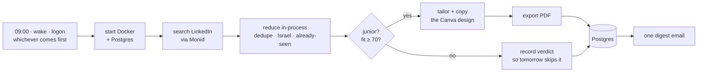

# Job Search Agent

**A daily agent that finds junior software jobs in Israel, judges which ones genuinely fit
*you*, and renders a job-tailored version of your real Canva résumé as a PDF for each strong
match.** One digest email lands every morning at 09:00.

It stops at "here's a tailored CV worth sending." It does **not** apply for you.



The interesting step is the third one. Deduplication, the location filter and *"have I
already judged this?"* all happen in this process, **before the model sees anything** — so a
job you were shown yesterday costs nothing today, not even the tokens to look at it. A
morning with genuinely new postings costs a couple of dollars; a second run the same day
costs a few cents, because there is nothing left to think about.

---

## One cycle, step by step

**1 · Trigger.** Windows starts `jobs run` at 09:00, or ~1 minute after the machine wakes,
or ~2 minutes after you log in — whichever comes first. One moment a day isn't enough on a
laptop: left on battery it hibernates in the early hours, and a hibernating machine is
electrically off, so no timer can reach it.

**2 · Preflight.** Starts Docker Desktop if its daemon is silent, brings up the Postgres
container, waits for it to answer. It *starts* its dependencies rather than assuming them —
nothing else on the machine will.
*On failure:* no run row exists yet, so it emails you the error and exits 1.

**3 · The once-per-day guard.** One query: has a run already finished successfully today? If
so it exits immediately — no search, no email, no cost. This is what makes three triggers
safe instead of three emails. A *failed* earlier run doesn't count, so a morning that broke
gets another attempt when the laptop wakes.

**4 · Open the run row.** From here everything is recorded in Postgres, including a crash.

**5 · Search.** Five role queries — software, backend, fullstack, AI engineer, QA automation
— filtered to Israel, entry level, posted in the last 24 hours, via Monid → Apify's
LinkedIn scraper. A typical morning returns 70–110 postings.

**6 · Reduce, before the model sees anything.** A hook intercepts the raw scrape in-process:
dedupe by id, drop anything not actually in Israel, and drop every posting already judged on
an earlier day. What reaches Claude is a manifest of about 97 bytes per job; the full
descriptions stay in this process and are served one at a time on request. Roughly 1 MB of
JSON becomes ~1 KB of context.

**7 · Judge.** Claude reads each remaining posting and scores it 0–100 against your CV, with
a one-line reason, judging from the stated requirements rather than the job title. **A
verdict is recorded for every posting, kept or rejected** — that row is what makes tomorrow
skip it for free.

**8 · Tailor** — only for jobs scoring ≥ 70. Claude drafts new wording; code decides whether
that draft is allowed (see the table below). Then the agent copies your pinned Canva design,
applies the approved edits, and two checks run: the element map is verified against the live
design in case you redesigned the template, and the result is measured to confirm nothing
overflowed the page.
*On failure:* the transaction is cancelled and the job skipped — never committed half-edited.
An overflowing draft is redrafted up to twice before giving up.

**9 · Export and store.** The design is exported as a PDF and written into Postgres with its
score, reasoning, apply URL and Canva link. `jobs pdf <id>` writes it back out later.

**10 · Close the run and email.** The run row is finished as `ok`, `empty` or `failed`, and
exactly one digest goes out. Everything printed along the way is in
`logs/run-YYYY-MM-DD.log`.

### What decides what

The split is the design of this project: Claude does judgement and prose, and nothing else.

| Decided by Claude | Decided by code |
|---|---|
| Is this job a fit, and why | The fit threshold that earns a CV |
| How to reword a bullet for this role | Whether that wording is truthful — invented skills stripped, bullets reworded one-to-one, length budgets enforced |
| Which jobs to skip and why | Which postings are even shown to it (dedupe, location, already-seen) |
| The summary paragraph | Whether the result fits on the page, measured from real geometry |
| — | What gets stored, and what you're emailed |

The agent has no `Bash`, `Read`, `Write`, `WebFetch` or `Agent` tools. A failure can't degrade
into hand-parsing files.

---

## Quickstart

Requires Python 3.11+, Docker Desktop, and a Canva account with your résumé in it.

```bash
python -m venv .venv
.venv/Scripts/pip install -e .
```

Create `.env` at the repo root (git-ignored):

```
ANTHROPIC_API_KEY=sk-ant-...
MONID_API_KEY=monid_live_...
GMAIL_ADDRESS=you@gmail.com
GMAIL_APP_PASSWORD=sixteencharacters
```

The Gmail app password comes from Google Account → Security → App passwords, and needs
2-step verification switched on.

Then point the agent at your CV:

```bash
jobs init
```

It opens your Canva design (read-only — it starts an editing transaction purely to read the
element ids, then cancels), works out which text box is your summary, your skills and each
job's bullets, and writes two files:

- **`profile.json`** — which box is which. Four editable slots; every other box is locked.
- **`base_cv.md`** — your CV as markdown, and **everything in the design ends up in it**. The
  command tells you so: *"All 40 blocks captured"*.

**Read `base_cv.md` before your first run.** It is the source of truth for every honesty check
the agent makes — which skills it may claim, how many bullets each job has. Canva supplies the
layout; this file supplies the facts. The guards diff against it precisely because it *isn't*
the thing being written to: you cannot validate a write against its own target.

From then on the file is yours. Edit it whenever your career changes; the agent reads it and
never rewrites it.

Finally:

```bash
jobs setup
```

Starts Postgres, creates the schema, checks every key, logs into Gmail to prove the app
password actually works, registers the scheduled task, and tells you whether your power plan
will let it wake the machine. Safe to re-run — it repairs a partial install rather than
complaining about one.

### What Canva is asked for

`jobs init` opens your browser once so you can authorise it against **your own** Canva account.
The consent screen asks to read and write designs, folders and assets. The token lives in your
home directory, never in this repository, which is why the same code works for anyone.

### Will it work with your CV?

Ten-second check: open your CV in Canva and click one of your bullet points.

- it selects **the whole job block**, or **all the bullets** → you're fine
- it selects **only that one line** → each bullet is its own text box, and `init` will refuse

Same test on a skill: the whole list should highlight, not one word.

`init` refuses, with an explanation, on multi-page designs, bullets split one per box, and
skills split into separate chips. It refuses rather than half-supporting them, because a CV
that's wrong in the wrong box is worse than one that was never tailored.

## The four commands

| Command | What it does |
|---|---|
| `jobs init` | Point the agent at your Canva CV. Run once, first. `--force` regenerates `base_cv.md`. |
| `jobs setup` | Install everything, once. Idempotent — re-running repairs a partial install. |
| `jobs run` | One day's work. The scheduled task calls this; add `--force` to re-run a finished day. |
| `jobs pdf <id>` | Write one stored CV to `output/<run date>/` and open it. |

The digest carries **no attachments**, so `jobs pdf <id>` is how a CV gets back out of the
database. The id is in the email.

## The daily contract

You get **exactly one email every morning** — the matches, "nothing today", or the failure.
Whichever trigger fires first does the work; the rest cost a single database query.

**So silence is the alarm.** No email means the scheduler never fired or the network was
down: the one class of failure nothing inside the program can report. Check
`logs/run-YYYY-MM-DD.log`; if the file doesn't exist, the task never ran at all.

## What it deliberately does not do

- **Apply to anything.** No auto-apply, no cover letters.
- **Keep backups.** `docker compose down -v` destroys the history permanently. The agent
  recovers — it just forgets.
- **Catch up on a missed day.** The search window is 24 hours and is never widened
  afterwards, so jobs posted on a day the machine never came on are never seen.
- **Name Canva designs per job.** `copy-design` has no title parameter and the API has no
  rename, so every copy inherits the template's name.
- **Tailor a two-page CV**, bullets split one per text box, or skills split into chips.
  `jobs init` refuses these and says why.

---

## Where to look next

| Directory | What's in it |
|---|---|
| [`src/jobsearch/`](src/jobsearch/README.md) | Settings and the database layer — the system of record |
| [`src/jobsearch/agent/`](src/jobsearch/agent/README.md) | The autonomous session and the hooks that constrain it |
| [`src/jobsearch/resume/`](src/jobsearch/resume/README.md) | CV parsing, truthfulness guards, Canva geometry |
| [`src/jobsearch/delivery/`](src/jobsearch/delivery/README.md) | The CLI, the digest email, the 09:00 task |
| [`tests/`](tests/README.md) | How to run them — and what they cannot catch |
| [`docs/`](docs/README.md) | The design record: one spec and one plan per phase |

A normal day costs roughly **$1.50–2.50** in Claude plus about **$0.12** on Monid. Everything
tunable — role queries, fit threshold, search window — lives in
[`src/jobsearch/config.py`](src/jobsearch/config.py).
