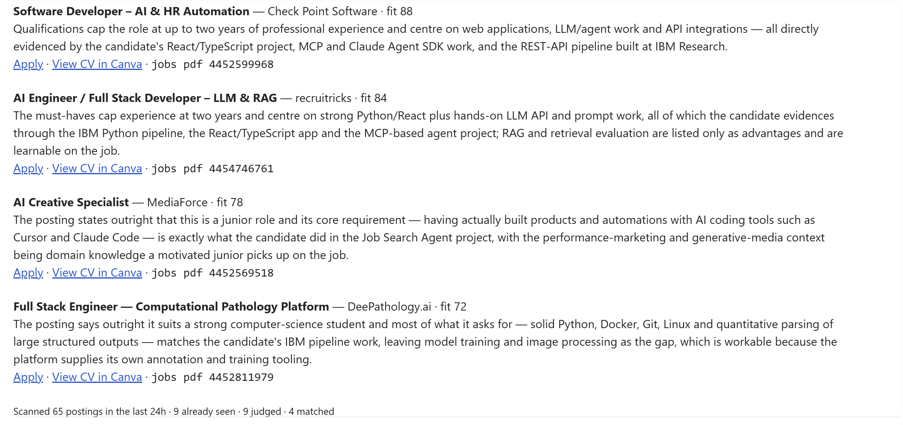

# Job Search Agent

> **An AI-powered job search assistant for software developers looking for junior roles in Israel.**

The agent finds relevant job postings, evaluates how well they match the candidate's CV, generates tailored CVs for strong matches, and sends a daily email with the best opportunities.

**It does not apply to jobs automatically.**  
The candidate reviews the results and decides which opportunities to pursue.

---

## 📬 Example Run

Output from a real daily run:



One email arrives every morning whichever way the run went — matches, nothing
over the threshold, or a failure. Silence means the scheduler itself is broken.

### 📄 View a Generated CV

Each match carries the posting's job ID. Pass it to `jobs pdf` to write that
CV out under `output/<run-date>/` and open it:

```bash
jobs pdf 4452599968
```

---

## ✨ How It Works

```text
┌──────────────┐
│   LinkedIn   │
└──────┬───────┘
       ↓
┌────────────────────┐
│ Collect & Dedup    │
└────────┬───────────┘
         ↓
┌────────────────────┐
│   AI Fit Analysis  │
└────────┬───────────┘
         ↓
┌────────────────────┐
│   Rank Matches     │
└────────┬───────────┘
         ↓
┌────────────────────┐
│ Generate Tailored  │
│        CV          │
└────────┬───────────┘
         ↓
┌────────────────────┐
│    Daily Email     │
└────────────────────┘
```

Postings come from LinkedIn, scraped through Monid's `harvestapi` endpoint and
filtered at the source to Israel, entry-level roles, and the last 24 hours. Claude
scores what survives that filter.

**LLM for judgment; deterministic code for enforcement.** Claude does the work
that benefits from reasoning and writing: scoring each posting against the CV and
drafting the tailored wording. Everything that must be repeatable stays in
application code — location filtering, cross-run deduplication, PostgreSQL
persistence, and the guards that reject a tailored CV claiming a skill the base CV
does not support. Those guards run as hooks on the agent's own tool calls, so they
hold whatever the model decides to write.

For every relevant job, the agent provides:

| | |
|---|---|
| 🎯 **Fit score** | How closely the role matches the candidate |
| 🧠 **AI reasoning** | Why the role is or isn't a good match |
| 🔗 **Apply link** | Direct link to the job posting |
| 🎨 **Canva link** | The tailored CV, open in Canva |
| 📄 **Job ID** | Pass it to `jobs pdf` to export the tailored CV |

---

# 🚀 Quick Start

## Requirements

- **Windows.** The agent registers a Windows scheduled task via `schtasks`, starts
  Docker Desktop from its default install path, and opens exported PDFs with
  `os.startfile`. There is no macOS or Linux path today.
- **Python 3.11+**
- **Docker Desktop**
- **Claude Code**, on `PATH`. The agent runs on the Claude Agent SDK, which drives
  the `claude` CLI as a subprocess; without it the SDK fails with
  `CLINotFoundError` before any work starts. The CLI is also where the Canva
  connection below is authorized, and no API key grants that.
- **Canva account** with an editable résumé template. Canva is reached through the
  **Canva MCP server**, not an API key: run `claude` once and approve the Canva
  connection before `jobs init`, or setup will stop at step 3.
- **Anthropic API key**, in `.env`. It authenticates and bills the model: the CLI
  subprocess inherits the environment and uses the key in preference to a
  claude.ai login. `jobs setup` stops if it is missing or blank. Both this and the
  CLI above are required — the key covers the model, the CLI covers Canva.
- **Monid API key**
- **Gmail account** with an app password

---

## 1. Install

Create a virtual environment:

```bash
python -m venv .venv
```

Activate it and install the project:

```bash
pip install -e .
```

---

## 2. Configure

Create a `.env` file in the project root:

```env
ANTHROPIC_API_KEY=...
MONID_API_KEY=...
GMAIL_ADDRESS=...
GMAIL_APP_PASSWORD=...
```

---

## 3. Connect Your CV

Provide the share link to the Canva résumé that will be used as the base template:

```bash
jobs init "<canva-resume-url>"
```

This reads the design, records which text box is which, and writes `base_cv.md`.

**Open `base_cv.md` and check it before going further.** It is the source of truth
for every honesty check the agent makes — which skills it may claim, and how many
bullets each job has. Text pulled out of a design can arrive garbled, so read it
once. `jobs init --force` regenerates it, discarding any edits you have made.

---

## 4. Initialize

```bash
jobs setup
```

This initializes the required services and configuration.

---

## 5. Run

Start a job-search cycle manually:

```bash
jobs run
```

The agent will:

```text
Search
  ↓
Deduplicate
  ↓
Evaluate
  ↓
Rank
  ↓
Generate CVs
  ↓
Send Email
```

---

# 🛠 CLI

| Command | Description |
|---|---|
| `jobs init <canva-url>` | Connect the candidate's base CV |
| `jobs init --force` | Regenerate `base_cv.md`, discarding your edits |
| `jobs setup` | Initialize the system |
| `jobs run` | Run a job-search cycle |
| `jobs run --force` | Run even if today's search already finished |
| `jobs pdf <id>` | Export a generated CV by job ID and open it |

---

# 🏗 Architecture

```text
src/jobsearch/

├── agent/       # Job discovery and AI evaluation
├── resume/      # CV processing and tailoring
├── delivery/    # CLI, email, and scheduling
├── config.py    # Application configuration
└── db.py        # PostgreSQL persistence
```

### Core Components

**🤖 [Agent](src/jobsearch/agent/README.md)**  
Discovers jobs and evaluates candidate fit.

**📄 [Resume Pipeline](src/jobsearch/resume/README.md)**  
Creates tailored CVs from the connected Canva template.

**🗄 Database**  
Stores jobs, evaluations, runs, and generated CVs.

**📬 [Delivery](src/jobsearch/delivery/README.md)**  
Handles CLI commands and email notifications.

Each package documents its own internals; [`src/jobsearch/`](src/jobsearch/README.md)
is the entry point.

---

# 🧰 Tech Stack

| Technology | Purpose |
|---|---|
| **Python 3.11+** | Application |
| **Anthropic Claude** | Job evaluation & CV tailoring |
| **Canva MCP** | CV generation & PDF export |
| **PostgreSQL** | Persistence |
| **Docker** | Local database environment |
| **Monid** | Job discovery — routes to the Apify harvestapi LinkedIn scraper |
| **Gmail** | Daily digest |
| **Pytest** | Testing |

---

# ⚠️ Limitations

- Applications are **not submitted automatically**.
- CV generation currently targets a **single-page Canva résumé**.
- Generated CVs depend on the structure and editable content of the connected Canva template.
- Each run searches a 24-hour window, so postings older than that are not picked up.
- PostgreSQL is required for persistent job and run history.

---

# 📁 Project Structure

```text
.
├── src/
│   └── jobsearch/
├── tests/
├── docs/
├── docker-compose.yml
├── pyproject.toml
├── schema.sql
└── README.md
```

---

## 📜 License

**MIT**