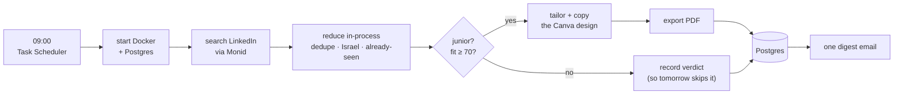

# R4 Structure and Documentation Implementation Plan

> **For agentic workers:** REQUIRED SUB-SKILL: Use superpowers:subagent-driven-development (recommended) or superpowers:executing-plans to implement this plan task-by-task. Steps use checkbox (`- [ ]`) syntax for tracking.

**Goal:** Reorganise `src/` into a real `jobsearch` package, send `jobs pdf` output to `output/<run date>/`, and replace one long README with a visual root README plus six directory READMEs.

**Architecture:** Nothing about the agent's behaviour changes. Task 2 is a pure move — imports only — and is deliberately atomic because a half-moved package does not import at all. Tasks 3 and 4 are the only behavioural change in the phase. Tasks 5 and 6 are documentation, written last so they describe the tree that actually exists.

**Tech Stack:** Python 3.11+, setuptools src-layout, pytest, psycopg 3, Postgres 16 in Docker.

## Global Constraints

- Spec: `docs/superpowers/specs/2026-08-14-structure-and-docs-design.md`
- Branch: `r4-structure-and-docs` (already created, spec already committed)
- Python package name: `jobsearch`. Import style is absolute — `from jobsearch.agent import tooling` — never relative (`from ..agent import tooling`).
- Console script must end up as `jobs = "jobsearch.delivery.cli:main"`.
- The Canva template design `DAHQxzJVWM4` is titled **"Dvir Resume"** (renamed by hand in Canva; no code depends on this).
- 239 tests pass today. Task 1 adds 3, Task 3 adds 1, Task 4 replaces 2 with 2. So: **242** from Task 1 through Task 2, **243** from Task 3 onward. Every one must pass.
- Never delete a test to make a move easier.
- `pytest` is `.venv/Scripts/python.exe -m pytest` on this machine.
- The 09:00 scheduled task runs `jobs.exe` by absolute path. A stale entry point fails silently until 09:00, so Task 2 is not complete until `jobs.exe` has been run for real.

---

### Task 1: Pin PROJECT_ROOT before anything moves

`config.PROJECT_ROOT = Path(__file__).parent.parent` resolves from `src/config.py` to the repo root. Task 2 moves `config.py` one directory deeper, which makes that expression resolve to `src/` instead — silently relocating `base_cv.md`, `schema.sql`, `logs/` and `output/`. Nothing would crash; the agent would just read a CV that isn't there.

**This test passes the moment you write it.** That is intentional and it is not a TDD violation — it is a characterisation test whose whole job is to fail in Task 2 if the move is done carelessly. Do not skip it because it is green.

**Files:**
- Test: `tests/test_config_paths.py` (create)

**Interfaces:**
- Consumes: `config.PROJECT_ROOT`, `config.BASE_CV_PATH`, `config.SCHEMA_PATH`, `config.LOG_DIR`
- Produces: nothing importable; a guard for Task 2

- [ ] **Step 1: Write the guard test**

```python
"""The repo-root anchor, pinned.

config.PROJECT_ROOT is computed by walking up from config.py's own location, so
it breaks the moment config.py changes depth in the tree -- silently, because a
wrong root still produces valid Path objects. Everything the agent reads from
disk hangs off it.
"""
import config


def test_project_root_is_the_real_repo_root():
    assert (config.PROJECT_ROOT / "pyproject.toml").is_file()
    assert (config.PROJECT_ROOT / "docker-compose.yml").is_file()


def test_the_paths_hanging_off_project_root_exist():
    # base_cv.md is gitignored but required at runtime; schema.sql is committed.
    assert config.SCHEMA_PATH.is_file()
    assert config.BASE_CV_PATH.is_file(), (
        "base_cv.md is missing -- either PROJECT_ROOT is wrong or the file was "
        "never created. See the README.")


def test_derived_directories_sit_under_the_repo_root(tmp_path):
    # Not that they exist -- they are created on demand -- but that they are
    # anchored where a human would look for them.
    assert config.LOG_DIR.parent == config.PROJECT_ROOT
```

- [ ] **Step 2: Run it and confirm it is GREEN**

Run: `.venv/Scripts/python.exe -m pytest tests/test_config_paths.py -v`
Expected: 3 passed. If any fail now, stop — something is already wrong and Task 2 would bury it.

- [ ] **Step 3: Commit**

```bash
git add tests/test_config_paths.py
git commit -m "test: pin PROJECT_ROOT before the package move

A wrong root still produces valid Path objects, so this breaks silently.
Green today on purpose -- its job is to fail in the next commit if the move
is careless."
```

---

### Task 2: Move src/ into the jobsearch package

**Atomic by necessity.** Every module imports its neighbours by bare name; move half and nothing imports. Do the whole task, then run the suite once.

**Files:**
- Create: `src/jobsearch/__init__.py`, `src/jobsearch/agent/__init__.py`, `src/jobsearch/resume/__init__.py`, `src/jobsearch/delivery/__init__.py`
- Move: all 14 modules (see the table in Step 2)
- Modify: `src/jobsearch/config.py` (PROJECT_ROOT depth), `pyproject.toml`, every import line listed in Steps 4 and 5

**Interfaces:**
- Produces, for every later task and every test:
  - `from jobsearch import config` / `from jobsearch import db`
  - `from jobsearch.agent import session, tools, tooling, hooks, jobs`
  - `from jobsearch.resume import base_cv, tailoring, canva, render`
  - `from jobsearch.delivery import cli, mailer, scheduling`
  - Console entry point `jobsearch.delivery.cli:main`

- [ ] **Step 1: Create the package directories**

```bash
mkdir -p src/jobsearch/agent src/jobsearch/resume src/jobsearch/delivery
touch src/jobsearch/__init__.py src/jobsearch/agent/__init__.py \
      src/jobsearch/resume/__init__.py src/jobsearch/delivery/__init__.py
```

On PowerShell, `New-Item -ItemType Directory -Force` and `New-Item -ItemType File`. Do **not** use `New-Item -Force` on an existing file — it truncates.

- [ ] **Step 2: Move the modules with `git mv`**

Use `git mv` so git records renames and the diff stays readable.

```bash
git mv src/agent.py       src/jobsearch/agent/session.py
git mv src/tools.py       src/jobsearch/agent/tools.py
git mv src/tooling.py     src/jobsearch/agent/tooling.py
git mv src/hooks.py       src/jobsearch/agent/hooks.py
git mv src/jobs.py        src/jobsearch/agent/jobs.py
git mv src/resume.py      src/jobsearch/resume/base_cv.py
git mv src/tailoring.py   src/jobsearch/resume/tailoring.py
git mv src/canva.py       src/jobsearch/resume/canva.py
git mv src/render.py      src/jobsearch/resume/render.py
git mv src/cli.py         src/jobsearch/delivery/cli.py
git mv src/mailer.py      src/jobsearch/delivery/mailer.py
git mv src/scheduling.py  src/jobsearch/delivery/scheduling.py
git mv src/config.py      src/jobsearch/config.py
git mv src/db.py          src/jobsearch/db.py
```

Two renames: `agent.py`→`session.py` and `resume.py`→`base_cv.py`, so the modules are not `agent.agent` and `resume.resume`.

- [ ] **Step 3: Fix PROJECT_ROOT — the one line that breaks silently**

In `src/jobsearch/config.py`, `config.py` is now one level deeper:

```python
# src/jobsearch/config.py -> src/jobsearch -> src -> the repo root.
# Three levels, not two: this file moved into the jobsearch package in R4, and
# everything read from disk (base_cv.md, schema.sql, logs/, output/) hangs off
# this. tests/test_config_paths.py fails loudly if it is ever wrong again.
PROJECT_ROOT = Path(__file__).parent.parent.parent
```

- [ ] **Step 4: Rewrite the imports in `src/`**

Every line below is a whole-line replacement. Left is what is there now; right is what it becomes.

`src/jobsearch/db.py`
- `import config` → `from jobsearch import config`

`src/jobsearch/agent/session.py`
- `import config` → `from jobsearch import config`
- `import hooks` → `from jobsearch.agent import hooks`
- `import tooling` → `from jobsearch.agent import tooling`
- `from tools import resume_tools` → `from jobsearch.agent.tools import resume_tools`

`src/jobsearch/agent/tooling.py`
- `import canva` → `from jobsearch.resume import canva`
- `import config` → `from jobsearch import config`
- `from config import (` → `from jobsearch.config import (`
- `from jobs import normalize_posting` → `from jobsearch.agent.jobs import normalize_posting`
- `from resume import parse_resume` → `from jobsearch.resume.base_cv import parse_resume`
- `from tailoring import (` → `from jobsearch.resume.tailoring import (`
- four in-function `import db` (around lines 106, 120, 357, 544) → `from jobsearch import db`
- one in-function `from render import pdf_filename` (around line 523) → `from jobsearch.resume.render import pdf_filename`

`src/jobsearch/agent/hooks.py`
- `import canva` → `from jobsearch.resume import canva`
- `import config` → `from jobsearch import config`
- `import tooling` → `from jobsearch.agent import tooling`
- `from resume import parse_resume` → `from jobsearch.resume.base_cv import parse_resume`
- `from tailoring import TailoredCV, strip_invented_skills` → `from jobsearch.resume.tailoring import TailoredCV, strip_invented_skills`

`src/jobsearch/agent/tools.py`
- `import config` → `from jobsearch import config`
- `import tooling` → `from jobsearch.agent import tooling`

`src/jobsearch/resume/base_cv.py`
- `from config import TAILORED_SECTIONS` → `from jobsearch.config import TAILORED_SECTIONS`

`src/jobsearch/resume/tailoring.py`
- `from config import EXPERIENCE_SECTION, PROJECTS_SECTION` → `from jobsearch.config import EXPERIENCE_SECTION, PROJECTS_SECTION`
- `from resume import ParsedResume` → `from jobsearch.resume.base_cv import ParsedResume`

`src/jobsearch/resume/render.py`
- `from tooling import safe_filename` → `from jobsearch.agent.tooling import safe_filename`

`src/jobsearch/delivery/cli.py`
- `import config` → `from jobsearch import config`
- `import db` → `from jobsearch import db`
- `import mailer` → `from jobsearch.delivery import mailer`
- `import scheduling` → `from jobsearch.delivery import scheduling`
- `import tooling` → `from jobsearch.agent import tooling`
- inside `_drive_session()` (around line 191), replace the lazy import and its call:

```python
def _drive_session():
    """Isolated so tests can replace the whole agent session.

    The import stays inside the function: delivery imports the agent session,
    and the session's module graph reaches back into delivery. Deferring it to
    call time is what keeps that from being an import cycle.
    """
    import asyncio

    from jobsearch.agent import session
    return asyncio.run(session.run_session())
```

`src/jobsearch/delivery/mailer.py`
- `import config` → `from jobsearch import config`

`src/jobsearch/delivery/scheduling.py`
- `import config` → `from jobsearch import config`

**Known wart, do not fix here:** `resume/render.py` imports `safe_filename` from `agent/tooling.py`, while `agent/tooling.py` imports `pdf_filename` back from `resume/render.py` inside a function. That cycle exists today and survives the move intact because the second import is lazy. Moving `safe_filename` would be a behavioural refactor; this task is a pure move. Note it in `resume/README.md` in Task 6.

- [ ] **Step 5: Rewrite the imports in `tests/`**

`tests/conftest.py`
- `import config` → `from jobsearch import config`
- `import db` → `from jobsearch import db`
- in-function `import tooling` (line 35) → `from jobsearch.agent import tooling`

`tests/test_cli.py`
- `import cli` → `from jobsearch.delivery import cli`
- `import config` → `from jobsearch import config`
- `import db` → `from jobsearch import db`
- `import tooling` → `from jobsearch.agent import tooling`
- in-function `import config as config_module` (line ~328) → `from jobsearch import config as config_module`

`tests/test_canva.py`
- `import canva` → `from jobsearch.resume import canva`
- both `from canva import ...` (lines 4 and 125) → `from jobsearch.resume.canva import ...`

`tests/test_db.py`
- `import db` → `from jobsearch import db`
- in-function `import config` (line 18) → `from jobsearch import config`

`tests/test_guards.py`
- `from resume import parse_resume` → `from jobsearch.resume.base_cv import parse_resume`
- `from tailoring import ...` → `from jobsearch.resume.tailoring import ...`

`tests/test_hooks.py`
- `import config` → `from jobsearch import config`
- `import hooks` → `from jobsearch.agent import hooks`
- `from tooling import strip_invented_skills` → `from jobsearch.agent.tooling import strip_invented_skills` (keep the `# noqa: F401` comment)

`tests/test_mailer.py`
- `import mailer` → `from jobsearch.delivery import mailer`
- all nine in-function `import config` → `from jobsearch import config`

`tests/test_jobs.py`
- `from jobs import JobPosting, normalize_posting` → `from jobsearch.agent.jobs import JobPosting, normalize_posting`

`tests/test_output_tools.py`
- `import tooling` → `from jobsearch.agent import tooling`
- all four in-function `import db` → `from jobsearch import db`

`tests/test_reduce.py`
- `import config` → `from jobsearch import config`
- `import tooling` → `from jobsearch.agent import tooling`
- `from tooling import reduce_run_payload` → `from jobsearch.agent.tooling import reduce_run_payload`
- three in-function `from tooling import is_run_in_progress` → `from jobsearch.agent.tooling import is_run_in_progress`

`tests/test_render.py`
- `from render import pdf_filename` → `from jobsearch.resume.render import pdf_filename`

`tests/test_resume.py`
- `from resume import Entry, ParsedResume, Section, parse_resume` → `from jobsearch.resume.base_cv import Entry, ParsedResume, Section, parse_resume`

`tests/test_payload_ceiling.py`
- `import config` → `from jobsearch import config`
- `import tooling` → `from jobsearch.agent import tooling`

`tests/test_scheduling.py`
- `import scheduling` → `from jobsearch.delivery import scheduling`

`tests/test_tooling.py`
- `import config` → `from jobsearch import config`
- `from tooling import build_resume_view, clean_jobs, prepare_resume, safe_filename` → `from jobsearch.agent.tooling import build_resume_view, clean_jobs, prepare_resume, safe_filename`

`tests/test_tailoring.py`
- `from resume import parse_resume` → `from jobsearch.resume.base_cv import parse_resume`
- `from tailoring import (` → `from jobsearch.resume.tailoring import (`

`tests/test_tools_import.py`
- `import config` → `from jobsearch import config`
- all `import tools` → `from jobsearch.agent import tools`
- all `import agent` → `from jobsearch.agent import session as agent`
- `import tooling` → `from jobsearch.agent import tooling`

The `session as agent` alias matters: this file calls `agent.build_options()`, `agent.WORKFLOW`, `agent._SEARCH_RECIPE` and `agent._SEARCH_RECIPE_BODY`. Aliasing keeps every assertion unchanged.

`tests/test_config_paths.py` (from Task 1)
- `import config` → `from jobsearch import config`

- [ ] **Step 6: Update `pyproject.toml`**

Replace the `[project.scripts]` and `[tool.setuptools]` blocks:

```toml
[project.scripts]
# The scheduled task invokes this executable by absolute path -- a
# non-interactive session does not inherit the interactive PATH.
jobs = "jobsearch.delivery.cli:main"

[tool.setuptools.packages.find]
# src-layout: one real package, `jobsearch`, with subpackages. Not flat modules
# on sys.path -- `config`, `tools`, `jobs` and `db` are far too generic to own
# at top level, where an installed distribution could shadow them.
where = ["src"]
include = ["jobsearch*"]
```

Delete the old `[tool.setuptools]` table entirely (both `package-dir` and `py-modules`). Leave `[tool.pytest.ini_options]` exactly as it is — `pythonpath = ["src"]` still resolves `jobsearch`.

- [ ] **Step 7: Reinstall so the entry point is regenerated**

Run: `.venv/Scripts/pip.exe install -e . --no-deps`
Expected: `Successfully installed job-search-agent`.

Skipping this leaves `jobs.exe` pointing at the module path `cli:main`, which no longer exists.

- [ ] **Step 8: Run the full suite**

Run: `.venv/Scripts/python.exe -m pytest -q`
Expected: **242 passed** (239 before this phase, plus Task 1's three).

If `tests/test_config_paths.py` fails, PROJECT_ROOT is wrong — re-read Step 3 rather than editing the test. If you see `ModuleNotFoundError`, one import line in Step 4 or 5 was missed; the error names it.

- [ ] **Step 9: Verify the real executable — the gate that protects 09:00**

```bash
.venv/Scripts/jobs.exe
```

Expected: the argparse usage message listing `setup`, `run`, `pdf`, and exit code 2. Anything else — especially `ModuleNotFoundError` — means the scheduled task would fail tomorrow morning. Do not commit until this passes.

Do **not** run `jobs run`; it costs money and this phase changes no agent behaviour.

- [ ] **Step 10: Commit**

```bash
git add -A
git commit -m "refactor: move src/ into the jobsearch package

Pure move: imports only, no behavioural change. Two files renamed so they are
not agent.agent and resume.resume. Also stops squatting on top-level names as
generic as config, tools, jobs and db.

PROJECT_ROOT gains a level -- the failure mode this refactor most invites,
which is why tests/test_config_paths.py landed first.

Verified: 240 tests, and jobs.exe runs (the 09:00 task invokes it by path)."
```

---

### Task 3: `db.fetch_pdf` returns the run's date

**Files:**
- Modify: `src/jobsearch/db.py` (`fetch_pdf`, around line 153)
- Modify: `tests/test_db.py:107`, `tests/test_output_tools.py:33` (existing call sites unpack two values)
- Test: `tests/test_db.py`

**Interfaces:**
- Consumes: `db.fetch_pdf(job_id, conn=None)`
- Produces: `fetch_pdf` now returns `(payload: bytes, filename: str, run_date: datetime.date)` or `None`. Task 4 consumes all three.

- [ ] **Step 1: Write the failing test**

Add to `tests/test_db.py`. Note what it compares against: the **database's** idea of today, not Python's. `created_at` defaults to `now()` inside a UTC container, and Israel is UTC+2/+3 — so between midnight and 03:00 local, `date.today()` and the stored date genuinely differ. Asserting against `date.today()` would pass all day and fail at night.

```python
def test_fetch_pdf_returns_the_date_the_cv_was_made(pg):
    """`jobs pdf` files exports under the run's date, so the date must come back
    with the bytes. Compared against the database's own today, not Python's:
    created_at is now() in a UTC container and this machine is UTC+3, so the two
    disagree for the first hours of every local day."""
    run_id = db.start_run("24h", pg)
    db.record_verdict("111", run_id, "Backend Dev", "Acme", 82, "matched", "r",
                      conn=pg)
    db.insert_match("111", run_id, title="Backend Dev", company="Acme",
                    location="Israel", apply_url="https://a/1",
                    posted_date="2026-08-12", canva_design_id="DAG1",
                    canva_url="https://c/1", pdf=b"%PDF-1.4 body",
                    pdf_filename="Acme_Backend_Dev_111.pdf", conn=pg)

    payload, filename, run_date = db.fetch_pdf("111", pg)

    assert payload == b"%PDF-1.4 body"
    assert filename == "Acme_Backend_Dev_111.pdf"
    with pg.cursor() as cur:
        cur.execute("SELECT now()::date")
        assert run_date == cur.fetchone()[0]
```

- [ ] **Step 2: Run it to verify it fails**

Run: `.venv/Scripts/python.exe -m pytest tests/test_db.py::test_fetch_pdf_returns_the_date_the_cv_was_made -v`
Expected: FAIL — `ValueError: not enough values to unpack (expected 3, got 2)`.

- [ ] **Step 3: Implement**

In `src/jobsearch/db.py`:

```python
def fetch_pdf(job_id, conn=None):
    """(bytes, filename, run_date) for one stored CV, or None.

    Backs `jobs pdf <id>`. The date is the day the CV was made, not today, so
    exporting the same job twice always lands in the same dated directory.
    """
    with _conn(conn).cursor() as cur:
        cur.execute("""SELECT pdf, pdf_filename, created_at::date
                       FROM matches WHERE job_id = %s""", (str(job_id),))
        row = cur.fetchone()
        return (bytes(row[0]), row[1], row[2]) if row else None
```

- [ ] **Step 4: Fix the two existing call sites**

`tests/test_db.py:107`: `pdf, filename = db.fetch_pdf("111", pg)` → `pdf, filename, _ = db.fetch_pdf("111", pg)`

`tests/test_output_tools.py:33`: `pdf, filename = db.fetch_pdf("4446167840", pg)` → `pdf, filename, _ = db.fetch_pdf("4446167840", pg)`

`src/jobsearch/delivery/cli.py` also unpacks two values in `command_pdf`; Task 4 rewrites that function, so leave it and expect `test_cli.py`'s two pdf tests to fail until then.

- [ ] **Step 5: Run the database tests**

Run: `.venv/Scripts/python.exe -m pytest tests/test_db.py tests/test_output_tools.py -q`
Expected: all pass.

- [ ] **Step 6: Commit**

```bash
git add src/jobsearch/db.py tests/test_db.py tests/test_output_tools.py
git commit -m "feat: fetch_pdf returns the date the CV was made

Third return value, so jobs pdf can file exports under the run's date rather
than today's -- re-exporting an old CV then lands where it belongs instead of
scattering one job across several dated folders."
```

---

### Task 4: `jobs pdf` writes to `output/<run date>/`

**Files:**
- Modify: `src/jobsearch/config.py` (add `OUTPUT_DIR`)
- Modify: `src/jobsearch/delivery/cli.py` (`command_pdf`)
- Modify: `tests/test_cli.py` (the two `pdf` tests)

**Interfaces:**
- Consumes: `db.fetch_pdf` → `(payload, filename, run_date)` from Task 3; `config.OUTPUT_DIR`
- Produces: `command_pdf(job_id, open_after=True)` writes `config.OUTPUT_DIR / run_date.isoformat() / filename`

- [ ] **Step 1: Write the failing tests**

Replace the two existing pdf tests in `tests/test_cli.py`. The old ones used `monkeypatch.chdir`; the destination no longer depends on the working directory at all, so they patch `config.OUTPUT_DIR` instead.

```python
def test_pdf_writes_under_the_run_date_not_the_working_directory(pg, monkeypatch,
                                                                  tmp_path):
    monkeypatch.setattr(db, "session", lambda: pg)
    monkeypatch.setattr(config, "OUTPUT_DIR", tmp_path / "output")
    run_id = db.start_run("24h", pg)
    db.record_verdict("111", run_id, "Backend Dev", "Acme", 82, "matched", "r",
                      conn=pg)
    db.insert_match("111", run_id, title="Backend Dev", company="Acme",
                    location="Israel", apply_url="https://a/1",
                    posted_date="2026-08-12", canva_design_id="DAG1",
                    canva_url="https://c/1", pdf=b"%PDF-1.4 body",
                    pdf_filename="Acme_Backend_Dev_111.pdf", conn=pg)

    assert cli.command_pdf("111", open_after=False) == 0

    with pg.cursor() as cur:
        cur.execute("SELECT now()::date")
        today = cur.fetchone()[0]
    written = tmp_path / "output" / today.isoformat() / "Acme_Backend_Dev_111.pdf"
    assert written.read_bytes() == b"%PDF-1.4 body"


def test_pdf_reports_an_unknown_job_without_creating_a_directory(pg, monkeypatch,
                                                                  tmp_path, capsys):
    monkeypatch.setattr(db, "session", lambda: pg)
    monkeypatch.setattr(config, "OUTPUT_DIR", tmp_path / "output")
    assert cli.command_pdf("nope", open_after=False) == 1
    assert "nope" in capsys.readouterr().out
    # An unknown id must not leave an empty dated folder behind.
    assert not (tmp_path / "output").exists()
```

- [ ] **Step 2: Run them to verify they fail**

Run: `.venv/Scripts/python.exe -m pytest tests/test_cli.py -k pdf -v`
Expected: FAIL — `AttributeError: <module 'jobsearch.config'> has no attribute 'OUTPUT_DIR'`.

- [ ] **Step 3: Add `OUTPUT_DIR` to config**

In `src/jobsearch/config.py`, immediately after `LOG_DIR`:

```python
# Where `jobs pdf <id>` writes a stored CV back out, under a dated subdirectory.
#
# This is NOT the OUTPUT_DIR deleted in R3. That one was the system of record --
# tailored CVs lived on disk and nowhere else. This one is only an export
# destination: Postgres holds the CV, and this is a copy you can attach to an
# email. Deleting the whole directory loses nothing.
OUTPUT_DIR = PROJECT_ROOT / "output"
```

- [ ] **Step 4: Rewrite `command_pdf`**

In `src/jobsearch/delivery/cli.py`:

```python
def command_pdf(job_id, open_after=True):
    """Write one stored CV under output/<run date>/ and open it.

    This is the only route from the database back to a file the operator can
    attach: the digest deliberately carries no attachments. Filed under the date
    the CV was made rather than today, so exporting the same job twice always
    lands in the same place.
    """
    load_dotenv()
    found = db.fetch_pdf(job_id)
    if found is None:
        print(f"No stored CV for job {job_id!r}. Check the id in the digest "
              f"email — it is the number after `jobs pdf`.")
        return 1
    payload, filename, run_date = found
    directory = config.OUTPUT_DIR / run_date.isoformat()
    directory.mkdir(parents=True, exist_ok=True)
    path = directory / filename
    path.write_bytes(payload)
    print(f"Wrote {path} ({len(payload):,} bytes)")
    if open_after:
        os.startfile(path)        # noqa: S606 - Windows-only by design
    return 0
```

Note the ordering: the `None` check happens before `mkdir`, which is what the second test pins.

- [ ] **Step 5: Run the full suite**

Run: `.venv/Scripts/python.exe -m pytest -q`
Expected: **243 passed** (242 after Task 2, plus Task 3's new test; Task 4 replaces two tests rather than adding any).

- [ ] **Step 6: Commit**

```bash
git add src/jobsearch/config.py src/jobsearch/delivery/cli.py tests/test_cli.py
git commit -m "feat: jobs pdf writes to output/<run date>/

Exports landed in whatever directory you happened to be standing in, which in
practice meant the repo root. OUTPUT_DIR returns for this -- deliberately not
the R3 OUTPUT_DIR, which was the system of record; this is only a copy."
```

---

### Task 5: The root README

**Files:**
- Modify: `README.md` (rewrite)

The current README is accurate and long — install, daily use, data layout, truthfulness, structure, tuning, troubleshooting. It is also the first thing a visitor sees. Move the depth out to Task 6's directory READMEs; keep the root short, visual and honest.

**Do not invent capabilities.** Every claim must already be true of the code. In particular: it stops at a tailored CV and does not apply for you; there are no backups; a day the machine never comes on is lost permanently.

- [ ] **Step 1: Rewrite `README.md`**

Structure, in order:

1. **Title and a two-sentence what-this-is.** Finds junior software jobs in Israel, judges fit against your real CV, renders a job-tailored version of your Canva résumé as a PDF, emails a digest at 09:00. Stops at "here is a CV worth sending" — it does not apply for you.

2. **The mermaid diagram**, exactly this block:

````markdown

````

3. **Quickstart** — `python -m venv .venv`, `.venv/Scripts/pip install -e .`, create `.env` (`MONID_API_KEY`, `ANTHROPIC_API_KEY`, `GMAIL_ADDRESS`, `GMAIL_APP_PASSWORD`), put your CV at `base_cv.md`, connect Canva, then `jobs setup`.

4. **The three commands** as a small table: `jobs setup`, `jobs run`, `jobs pdf <id>`.

5. **The daily contract** — one email every morning, in three flavours (matches / nothing today / failure). Therefore **silence is the alarm**: it means the scheduler itself did not fire, or the network was down. `logs/run-YYYY-MM-DD.log` says which.

6. **What it deliberately does not do** — apply to jobs; keep backups; widen the search window after a missed day (a day the machine never comes on is lost permanently); name Canva designs per job (the API cannot).

7. **Where to look next**, as a table linking every directory README:

| Directory | What's in it |
|---|---|
| [`src/jobsearch/`](src/jobsearch/README.md) | settings and the database layer |
| [`src/jobsearch/agent/`](src/jobsearch/agent/README.md) | the autonomous session and its guardrails |
| [`src/jobsearch/resume/`](src/jobsearch/resume/README.md) | CV parsing, truthfulness guards, Canva geometry |
| [`src/jobsearch/delivery/`](src/jobsearch/delivery/README.md) | the CLI, the digest email, the 09:00 task |
| [`tests/`](tests/README.md) | how to run them, and what they cannot catch |
| [`docs/`](docs/README.md) | the design record, one spec and plan per phase |

- [ ] **Step 2: Check the mermaid actually renders**

Paste the diagram block into <https://mermaid.live>. Expected: a left-to-right flowchart with a diamond and no syntax error. `<br/>` and `·` are valid inside quoted labels; unquoted parentheses are not.

- [ ] **Step 3: Verify every link resolves**

The six files in the table do not exist until Task 6. Confirm each path string matches a path Task 6 creates, character for character.

- [ ] **Step 4: Commit**

```bash
git add README.md
git commit -m "docs: rewrite the root README around the daily flow

Short, visual, and honest about the limits: no backups, a missed day is lost,
and Canva cannot name designs per job. Operational depth moves to the
directory READMEs."
```

---

### Task 6: The six directory READMEs

**Files:**
- Create: `src/jobsearch/README.md`, `src/jobsearch/agent/README.md`, `src/jobsearch/resume/README.md`, `src/jobsearch/delivery/README.md`, `tests/README.md`, `docs/README.md`

Each README does three things: say what the directory is for, list its files with one line each, and record **the invariant that directory exists to protect**. The invariant is the part worth writing — file lists rot, invariants explain why the code is shaped as it is.

Reuse the measured facts already in the code comments rather than inventing prose. They are the valuable content.

- [ ] **Step 1: `src/jobsearch/README.md`**

Covers `config.py` and `db.py`, and maps the three subpackages.

Invariant: **Postgres is the system of record and no SQL lives outside `db.py`.** Include the three tables and what each holds; that `seen`'s primary key *is* the dedup mechanism; that score and reason live only in `seen` so the email can never report a score the CV was not gated on; that the container binds `127.0.0.1:5433` because a native PostgreSQL 18 service already owns 5432; and that there are **no backups** by explicit choice. Also note `config.py` calls `load_dotenv()` at import, and why: reading `os.environ` before `.env` loaded once made the digest silently unsendable.

- [ ] **Step 2: `src/jobsearch/agent/README.md`**

Covers `session.py`, `tools.py`, `tooling.py`, `hooks.py`, `jobs.py`.

Invariant: **the enforcement boundary is the hooks, not the prompt.** The model makes the Canva calls, so a `PreToolUse` hook inspecting what is about to be written is the only real boundary; `allowed_tools` merely pre-approves, which is why `disallowed_tools` denies Bash/Read/Write/WebFetch/Agent. Include the payload-reduction story and both measured ceilings — `MAX_MCP_OUTPUT_TOKENS` governs the guard that runs *before* the hook, and a separate 32KB cap applies to what the hook hands *back*, with no env var to raise it. Note that cross-run dedup runs inside the reduction hook, before any posting reaches the model, which is what makes a repeat job cost nothing.

- [ ] **Step 3: `src/jobsearch/resume/README.md`**

Covers `base_cv.py`, `tailoring.py`, `canva.py`, `render.py`.

Invariant: **truthfulness guards run in code and are never delegated to the model.** Skills not present in `base_cv.md` are stripped; bullets are reworded one-to-one; length budgets are enforced before anything reaches Canva. Record the Canva facts that cost live runs to learn: `replace_text` inherits the first region's formatting, so a block whose first region is an empty spacer loses every bullet marker (hence per-bullet `find_and_replace_text`); and a `find_and_replace_text` that matches nothing still reports success, so operation results are never trusted alone. State that the pinned template `DAHQxzJVWM4` is titled **"Dvir Resume"**, that copies inherit that title because `copy-design` has no title parameter and the MCP has no rename tool, and note the `render.py` ↔ `agent/tooling.py` import cycle that a lazy import keeps benign.

- [ ] **Step 4: `src/jobsearch/delivery/README.md`**

Covers `cli.py`, `mailer.py`, `scheduling.py`.

Invariant: **exactly one email every morning, so silence is the alarm.** Document the three digest flavours; that `jobs pdf` is load-bearing because the digest carries no attachments; that `jobs run` starts Docker Desktop and the container itself rather than waiting for them, and why (2026-08-14: the task fired 7 minutes after a reboot into a machine with no daemon); that every run tees stderr to `logs/run-YYYY-MM-DD.log` because a scheduled console closes with the process and a preflight failure never writes a `runs` row; that the task XML sets `WakeToRun` and `StartWhenAvailable`; and that **wake timers must be enabled on battery as well as AC** (`powercfg /query SCHEME_CURRENT SUB_SLEEP RTCWAKE` — both indexes `0x1`), because the Windows default of disabled-on-battery silently turns `WakeToRun` into dead weight. Include the `jobs.exe` absolute-path requirement and that a layout change demands `pip install -e .`.

- [ ] **Step 5: `tests/README.md`**

How to run (`.venv/Scripts/python.exe -m pytest`), and that database tests use a **real throwaway Postgres** (`jobs_test`), not a mock — because the design's dedup is enforced by a primary key, and a mock would test the mock. Note they skip with a clear message when the container is down.

Invariant: **a green suite is necessary but not sufficient.** Every serious defect in this project's history surfaced in a live run, never in the suite, and the suite was green each time — because these bugs live in the seams between our code and something external, and tests mock those seams so both halves of a mismatch stay internally consistent. Give the clearest example: `session.py` sent a flat `input` while `tooling._window()` read `input.body` — two parts of *our own* code disagreeing, invisible to any test of either side alone. Conclude with the rule that came out of it: prefer probes that pin both ends together, and budget one live run per phase.

- [ ] **Step 6: `docs/README.md`**

Short. `superpowers/specs/` and `superpowers/plans/` hold one spec and one plan per phase, named by date, kept as the decision record rather than as current documentation — a spec describes what was decided then, so where it disagrees with the code, the code wins. List the phases in order (R1 agent SDK refactor and payload reduction, R2 Canva PDF output, R3 daily agent on Postgres, R4 structure and docs) and note that `agent-sdk-reference.md` is vendor reference material.

- [ ] **Step 7: Verify every root README link resolves**

```bash
git status --short
```

Expected: six new `README.md` files, at exactly the six paths in the root README's table. Open the root README and confirm each link target now exists.

- [ ] **Step 8: Run the suite one last time**

Run: `.venv/Scripts/python.exe -m pytest -q`
Expected: **243 passed**. Documentation cannot break tests, but a stray edit can.

- [ ] **Step 9: Commit**

```bash
git add src/jobsearch/README.md src/jobsearch/agent/README.md \
        src/jobsearch/resume/README.md src/jobsearch/delivery/README.md \
        tests/README.md docs/README.md
git commit -m "docs: a README per directory, each recording its invariant

File lists rot; invariants explain why the code is shaped as it is. Each one
carries the measured facts that live runs cost us to learn."
```

---

## Done when

- `.venv/Scripts/python.exe -m pytest -q` → 243 passed
- `.venv/Scripts/jobs.exe` → usage message, exit 2
- `git status` clean, six commits on `r4-structure-and-docs`
- The Canva template is renamed to "Dvir Resume" by hand (Dvir's step, blocks nothing)

The next scheduled 09:00 run is the real check. No live agent run is needed in this phase — nothing here changes agent behaviour, and a run costs money.
